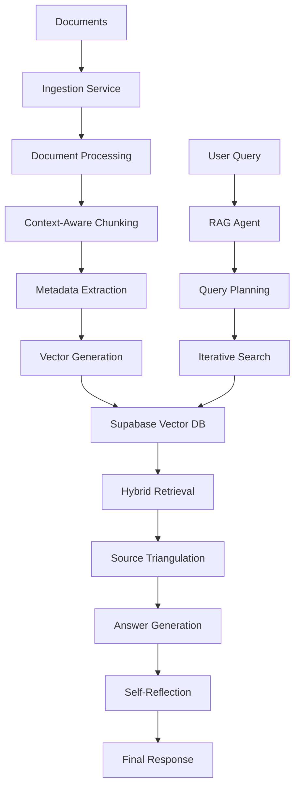

# Complete RAG System Documentation

## 🎯 System Overview

This repository contains a complete, production-ready RAG (Retrieval-Augmented Generation) system with three integrated services:

1. **🔄 LlamaIndex Ingestion Service** - Advanced document processing and ingestion
2. **🗄️ Supabase Vector Database** - Hybrid search with PostgreSQL + pgvector
3. **🤖 PydanticAI Agentic RAG Agent** - Intelligent query processing with planning and reflection

## 📁 Repository Structure

```
rag_system/
├── 📁 ingestion_service/           # Document ingestion pipeline
│   ├── 📄 main.py                  # FastAPI service entry point
│   ├── 📄 config.py                # Configuration management
│   ├── 📄 requirements.txt         # Python dependencies
│   ├── 📁 processors/              # Document processors
│   ├── 📁 utils/                   # Utility functions
│   └── 📄 README.md               # Service documentation
├── 📁 vector_database/             # Database setup and management
│   ├── 📄 setup.sql               # Main schema setup
│   ├── 📄 functions.sql           # Search functions
│   ├── 📁 scripts/                # Deployment scripts
│   │   └── 📄 deploy.sh           # Automated deployment
│   └── 📄 README.md               # Database documentation
├── 📁 agentic_rag_agent/          # Intelligent RAG agent
│   ├── 📄 main.py                 # FastAPI service entry point
│   ├── 📄 config.py               # Configuration management
│   ├── 📄 requirements.txt        # Python dependencies
│   ├── 📁 agents/                 # Agent implementations
│   ├── 📁 models/                 # Pydantic data models
│   ├── 📁 tools/                  # Agent tools
│   └── 📄 README.md              # Agent documentation
├── 📁 docs/                       # Additional documentation
├── 📁 examples/                   # Usage examples
├── 📁 tests/                      # Test suites
├── 📄 docker-compose.yml          # Container orchestration
├── 📄 .env.example                # Environment template
└── 📄 README.md                  # This file
```

## 🚀 Quick Start

### 1. Environment Setup

```bash
# Clone the repository
git clone <repository-url>
cd rag_system

# Copy environment template
cp .env.example .env

# Edit .env with your API keys and database URLs
# Required:
# - OPENAI_API_KEY
# - SUPABASE_URL
# - SUPABASE_SERVICE_KEY
```

### 2. Database Setup

```bash
cd vector_database/

# Set environment variables
export SUPABASE_URL="your_supabase_url"
export SUPABASE_SERVICE_KEY="your_service_key"

# Deploy database schema
chmod +x scripts/deploy.sh
./scripts/deploy.sh
```

### 3. Start Services

#### Option A: Docker Compose (Recommended)
```bash
# Start all services
docker-compose up -d

# Services will be available at:
# - Ingestion Service: http://localhost:8000
# - RAG Agent: http://localhost:8001
```

#### Option B: Manual Setup
```bash
# Terminal 1: Start ingestion service
cd ingestion_service/
pip install -r requirements.txt
python main.py

# Terminal 2: Start RAG agent
cd agentic_rag_agent/
pip install -r requirements.txt
python main.py
```

### 4. Basic Usage

```python
import asyncio
import httpx

async def main():
    # 1. Ingest documents
    async with httpx.AsyncClient() as client:
        response = await client.post(
            "http://localhost:8000/ingest/files",
            json={"file_paths": ["path/to/document.pdf"]}
        )
        task_id = response.json()["task_id"]
        print(f"Ingestion started: {task_id}")
    
    # 2. Query the system
    async with httpx.AsyncClient() as client:
        response = await client.post(
            "http://localhost:8001/ask",
            json={
                "question": "What are the key findings in the document?",
                "enable_iteration": True,
                "enable_reflection": True
            }
        )
        result = response.json()
        print(f"Answer: {result['answer']}")
        print(f"Confidence: {result['confidence']}")

asyncio.run(main())
```

## 🔧 Service Details

### Ingestion Service (Port 8000)

**Purpose**: Process and ingest documents into the vector database

**Key Features**:
- ✅ 15+ file types supported (PDF, DOCX, CSV, images, audio, code)
- ✅ Context-aware chunking with semantic boundaries
- ✅ Multi-modal processing (OCR, speech-to-text)
- ✅ Concurrent processing with configurable batch sizes
- ✅ Comprehensive metadata extraction
- ✅ Error handling and progress tracking

**API Endpoints**:
- `POST /ingest/files` - Ingest specific files
- `POST /ingest/directory` - Ingest entire directories
- `POST /ingest/upload` - Upload and ingest files
- `GET /ingest/status/{task_id}` - Check ingestion status
- `GET /health` - Service health check

### Vector Database

**Purpose**: Store and retrieve document vectors with hybrid search

**Key Features**:
- ✅ PostgreSQL + pgvector for vector similarity search
- ✅ Hybrid search combining semantic and keyword matching
- ✅ HNSW indexing for fast approximate search
- ✅ Full-text search with GIN indexes
- ✅ Advanced SQL functions for complex queries
- ✅ Performance optimizations and monitoring

**Search Functions**:
- `hybrid_search()` - Combined vector + BM25 search
- `semantic_search()` - Pure vector similarity
- `keyword_search()` - Traditional text search
- `get_document_stats()` - Database statistics

### Agentic RAG Agent (Port 8001)

**Purpose**: Intelligent question answering with planning and reflection

**Key Features**:
- ✅ Query planning and decomposition
- ✅ Iterative search with gap detection
- ✅ Self-reflection and quality assessment
- ✅ Source triangulation and verification
- ✅ Confidence scoring and transparency
- ✅ WebSocket streaming support

**API Endpoints**:
- `POST /ask` - Full agentic question answering
- `POST /ask/simple` - Basic RAG without agentic features
- `POST /ask/batch` - Batch question processing
- `GET /metrics` - Performance metrics
- `WS /ws/ask` - WebSocket streaming interface

## 🏗️ Architecture Flow



## ⚙️ Configuration

### Environment Variables

Create a `.env` file with:

```bash
# Required API Keys
OPENAI_API_KEY=your_openai_api_key
SUPABASE_URL=your_supabase_url
SUPABASE_SERVICE_KEY=your_supabase_service_key

# Ingestion Service
CHUNK_SIZE=1024
CHUNK_OVERLAP=200
ENABLE_OCR=true
ENABLE_SPEECH_TO_TEXT=true
MAX_CONCURRENT_FILES=5
BATCH_SIZE=100

# Vector Database
TABLE_NAME=rag_documents

# RAG Agent
LLM_MODEL=gpt-4-turbo
EMBEDDING_MODEL=text-embedding-3-large
ENABLE_RERANKING=true
MAX_ITERATIONS=3
VECTOR_WEIGHT=0.7
BM25_WEIGHT=0.3

# Performance
LOG_LEVEL=INFO
ENABLE_CACHE=true
DEBUG_MODE=false
```

### Advanced Configuration

Each service supports extensive configuration options. See individual service documentation for details:

- **Ingestion**: Chunking strategies, file type handling, OCR settings
- **Database**: Index tuning, search weights, performance optimization
- **Agent**: Agentic features, model selection, reasoning parameters

## 📊 Monitoring and Metrics

### Health Checks

```bash
# Check all services
curl http://localhost:8000/health  # Ingestion service
curl http://localhost:8001/health  # RAG agent

# Database health via agent
curl http://localhost:8001/metrics
```

### Performance Metrics

The system tracks comprehensive metrics:

- **Ingestion**: Processing time, success rates, file types
- **Search**: Query time, result quality, cache hit rates
- **Agent**: Iteration counts, confidence scores, reasoning quality

### Logging

Structured logging with configurable levels:

```python
# View logs
docker-compose logs -f ingestion_service
docker-compose logs -f rag_agent

# Configure log levels
export LOG_LEVEL=DEBUG  # DEBUG, INFO, WARNING, ERROR
```

## 🧪 Testing

### Unit Tests

```bash
# Run all tests
pytest tests/

# Test specific components
pytest tests/test_ingestion.py
pytest tests/test_search.py
pytest tests/test_agent.py
```

### Integration Tests

```bash
# End-to-end testing
pytest tests/test_integration.py

# Load testing
pytest tests/test_performance.py --load-test
```

### Manual Testing

```bash
# Test ingestion
curl -X POST "http://localhost:8000/ingest/files" \
  -H "Content-Type: application/json" \
  -d '{"file_paths": ["test_document.pdf"]}'

# Test query
curl -X POST "http://localhost:8001/ask" \
  -H "Content-Type: application/json" \
  -d '{"question": "What is machine learning?"}'
```

## 📈 Scaling and Deployment

### Production Deployment

1. **Container Orchestration**: Use Kubernetes or Docker Swarm
2. **Load Balancing**: Deploy multiple agent instances behind a load balancer
3. **Database Scaling**: Use read replicas for search workloads
4. **Caching**: Add Redis for query and embedding caching
5. **Monitoring**: Integrate with Prometheus/Grafana

### Performance Optimization

- **Ingestion**: Increase `max_concurrent_files` and `batch_size`
- **Database**: Tune HNSW parameters and connection pooling
- **Agent**: Enable caching and adjust iteration limits

### Resource Requirements

| Component | CPU | Memory | Storage |
|-----------|-----|--------|---------|
| Ingestion Service | 2-4 cores | 4-8 GB | 10 GB |
| Vector Database | 4-8 cores | 8-32 GB | 100+ GB SSD |
| RAG Agent | 2-4 cores | 4-8 GB | 5 GB |

## 🛠️ Development

### Adding New File Types

1. Extend `MultiModalFileProcessor` in ingestion service
2. Add type detection logic
3. Implement processing method
4. Update configuration options

### Custom Agent Tools

1. Create tool function with `@agent.tool` decorator
2. Define input/output models
3. Register with agent
4. Add to API endpoints

### Database Customization

1. Modify schema in `setup.sql`
2. Add new search functions in `functions.sql`
3. Update deployment scripts
4. Test with existing data

## 🚨 Troubleshooting

### Common Issues

**1. Ingestion Failures**
```bash
# Check file permissions and size limits
ls -la /path/to/files
echo $MAX_FILE_SIZE_MB

# Review logs
docker-compose logs ingestion_service
```

**2. Search Not Working**
```bash
# Verify database connection
curl http://localhost:8001/search/test

# Check vector extension
psql -c "SELECT * FROM pg_extension WHERE extname = 'vector';"
```

**3. Performance Issues**
```bash
# Monitor resource usage
docker stats

# Check cache hit rates
curl http://localhost:8001/metrics
```

### Debug Mode

Enable detailed debugging:

```bash
export DEBUG_MODE=true
export LOG_REASONING_STEPS=true
export SAVE_INTERMEDIATE_RESULTS=true
```

## 🤝 Contributing

1. Fork the repository
2.