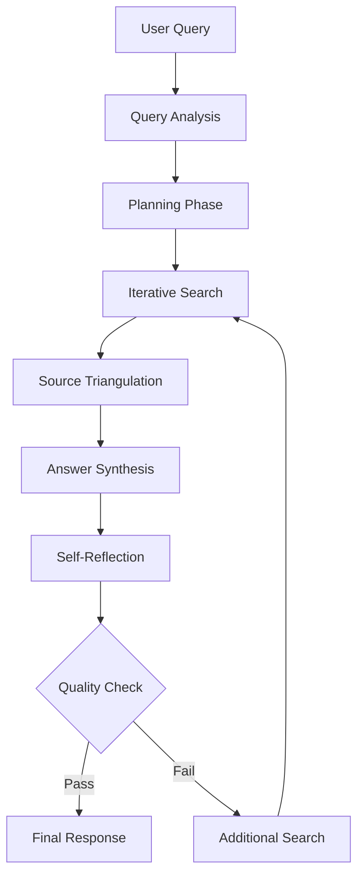

# PydanticAI Agentic RAG Agent Documentation

## Overview

The PydanticAI Agentic RAG Agent is an advanced retrieval-augmented generation system that goes beyond traditional RAG by incorporating intelligent reasoning, planning, and self-reflection capabilities. Built on PydanticAI, it provides sophisticated query understanding, iterative information gathering, source triangulation, and quality assessment for comprehensive knowledge-based question answering.

## 🎯 Goals

- **Intelligent Query Planning**: Decompose complex questions into strategic sub-queries
- **Iterative Retrieval**: Adaptive search with gap detection and coverage optimization
- **Self-Reflection**: Quality assessment and answer validation with confidence scoring
- **Source Triangulation**: Cross-reference multiple sources for accuracy verification
- **Explainable AI**: Transparent reasoning chains and decision processes
- **Hybrid Search Integration**: Seamless combination of vector and keyword search

## 🏗️ Service Architecture

### Component Structure

```
📁 agentic_rag_agent/
├── 📄 main.py                          # Service entry point
├── 📄 config.py                        # Configuration management
├── 📄 agents/
│   ├── 📄 base_agent.py                # Core agent implementation
│   ├── 📄 planning_agent.py            # Query planning logic
│   ├── 📄 reflection_agent.py          # Self-assessment capabilities
│   └── 📄 search_agent.py              # Search coordination
├── 📄 models/
│   ├── 📄 request_models.py            # Input data models
│   ├── 📄 response_models.py           # Output data models
│   └── 📄 internal_models.py           # Internal processing models
├── 📄 tools/
│   ├── 📄 search_tools.py              # Database search functions
│   ├── 📄 analysis_tools.py            # Content analysis utilities
│   └── 📄 triangulation_tools.py       # Source verification tools
├── 📄 services/
│   ├── 📄 database_manager.py          # Database operations
│   ├── 📄 embedding_service.py         # Embedding generation
│   └── 📄 reranking_service.py         # Result reranking
├── 📄 utils/
│   ├── 📄 logger.py                    # Logging configuration
│   ├── 📄 metrics.py                   # Performance monitoring
│   └── 📄 validators.py                # Input validation
└── 📄 requirements.txt                 # Dependencies
```

### Agentic RAG Workflow



## 🧠 Core Agentic Features

### 1. Query Planning & Decomposition

**Intelligent Query Analysis:**
- Classifies queries as factual, analytical, or comparative
- Breaks down complex questions into manageable sub-queries
- Determines optimal search strategies based on query type
- Predicts relevant source types and content domains

**Example Planning Process:**
```python
# Input: "Compare machine learning algorithms for NLP tasks"
query_plan = await agent.plan_query_execution(user_query)
# Output: QueryPlan with sub-queries, strategy, and reasoning
```

### 2. Iterative Information Gathering

**Adaptive Search Strategy:**
- Executes multiple search rounds with different parameters
- Identifies information gaps and coverage areas
- Adapts search terms based on intermediate findings
- Tracks unique sources and content diversity

**Search Evolution:**
```python
# Round 1: Broad search for "machine learning algorithms"
# Round 2: Focused search for "NLP performance metrics"  
# Round 3: Gap-filling search for "algorithm comparison studies"
```

### 3. Self-Reflection & Quality Assessment

**Multi-Dimensional Evaluation:**
- **Quality Score**: Keyword overlap, source diversity, answer length
- **Completeness Score**: Question component coverage assessment
- **Accuracy Assessment**: Confidence levels and reliability indicators
- **Gap Detection**: Missing information identification

**Confidence Calculation:**
```python
quality_score = (keyword_overlap + source_diversity + length_score) / 3
confidence = quality_score * completeness_score
```

### 4. Source Triangulation

**Verification Process:**
- Extracts key concepts from primary sources
- Searches for corroborating evidence
- Seeks alternative perspectives
- Cross-references facts across multiple documents

### 5. Hybrid Search with Reranking

**Multi-Stage Retrieval:**
1. **Vector Search**: Semantic similarity using embeddings
2. **Keyword Search**: BM25 scoring for exact matches
3. **Hybrid Combination**: Weighted scoring (70% vector, 30% BM25)
4. **Cross-Encoder Reranking**: Fine-grained relevance assessment

## 🚀 Getting Started

### Installation

```bash
# Clone the repository
git clone <repository-url>
cd agentic_rag_agent/

# Install dependencies
pip install -r requirements.txt

# Install optional dependencies for enhanced features
pip install sentence-transformers torch
```

### Environment Configuration

Create a `.env` file:

```bash
# Required API Keys
OPENAI_API_KEY=your_openai_api_key
SUPABASE_URL=your_supabase_url
SUPABASE_SERVICE_KEY=your_supabase_service_key

# Model Configuration
LLM_MODEL=gpt-4-turbo
EMBEDDING_MODEL=text-embedding-3-large
RERANK_MODEL=cross-encoder/ms-marco-MiniLM-L-6-v2

# Performance Settings
MAX_ITERATIONS=3
DEFAULT_MAX_RESULTS=10
ENABLE_RERANKING=true

# Logging
LOG_LEVEL=INFO
```

### Basic Usage

```python
import asyncio
from agentic_rag_agent import AgenticRAGService, RAGConfig

async def main():
    # Configure the service
    config = RAGConfig(
        supabase_url="your_supabase_url",
        supabase_key="your_supabase_key",
        table_name="rag_documents",
        llm_model="gpt-4-turbo",
        embedding_model="text-embedding-3-large",
        enable_reranking=True,
        default_max_results=10
    )
    
    # Initialize the agentic RAG service
    rag_service = AgenticRAGService(config)
    
    # Ask a complex question
    question = "What are the key differences between transformer and CNN architectures for computer vision tasks?"
    
    response = await rag_service.ask_with_planning(
        question=question,
        enable_iteration=True,
        enable_reflection=True,
        enable_triangulation=True
    )
    
    # Display results
    print(f"Answer: {response.answer}")
    print(f"Confidence: {response.confidence:.2f}")
    print(f"Sources: {len(response.sources)}")
    print(f"Search Iterations: {len(response.search_iterations)}")
    
    # Show reasoning process
    print("\nReasoning Chain:")
    for step in response.reasoning_chain:
        print(f"- {step}")
    
    # Display follow-up suggestions
    print("\nSuggested Follow-ups:")
    for suggestion in response.follow_up_suggestions:
        print(f"- {suggestion}")

if __name__ == "__main__":
    asyncio.run(main())
```

## ⚙️ Configuration Options

### RAGConfig Parameters

| Parameter | Type | Default | Description |
|-----------|------|---------|-------------|
| `supabase_url` | str | Required | Supabase project URL |
| `supabase_key` | str | Required | Supabase service key |
| `table_name` | str | "rag_documents" | Vector storage table name |
| `llm_model` | str | "gpt-4-turbo" | Language model for reasoning |
| `embedding_model` | str | "text-embedding-3-large" | Embedding model for vectors |
| `rerank_model` | str | "cross-encoder/ms-marco-MiniLM-L-6-v2" | Reranking model |
| `enable_reranking` | bool | True | Enable cross-encoder reranking |
| `vector_weight` | float | 0.7 | Weight for vector similarity in hybrid search |
| `bm25_weight` | float | 0.3 | Weight for BM25 score in hybrid search |
| `default_similarity_threshold` | float | 0.7 | Minimum similarity for retrieval |
| `default_max_results` | int | 10 | Maximum documents per search |
| `rerank_top_k` | int | 20 | Documents to consider for reranking |
| `max_context_length` | int | 8000 | Maximum context for answer generation |
| `min_confidence_threshold` | float | 0.3 | Minimum confidence for responses |

## 🔧 Advanced Features

### Custom Agent Tools

```python
@agent.tool
async def domain_specific_search(
    ctx: RunContext,
    query: str,
    domain: str,
    specialty_filters: List[str]
) -> SearchResults:
    """Custom tool for domain-specific searches"""
    # Implement specialized search logic
    pass

# Register custom tool
agent.register_tool(domain_specific_search)
```

### Multi-Modal Query Support

```python
# Image + text queries
response = await rag_service.ask_multimodal(
    text_query="Explain this diagram",
    image_path="path/to/diagram.png",
    enable_ocr=True
)

# Audio + text queries  
response = await rag_service.ask_multimodal(
    text_query="Summarize this meeting",
    audio_path="path/to/meeting.mp3",
    enable_transcription=True
)
```

### Custom Reflection Criteria

```python
class CustomReflectionAgent:
    def assess_domain_accuracy(self, answer: str, domain: str) -> float:
        # Implement domain-specific accuracy assessment
        pass
    
    def check_citation_quality(self, sources: List[DocumentChunk]) -> float:
        # Evaluate source credibility and citation quality
        pass
```

## 📊 Response Models

### AgenticRAGResponse Structure

```python
class AgenticRAGResponse(BaseModel):
    answer: str                          # Generated answer
    confidence: float                    # Confidence score (0-1)
    sources: List[DocumentChunk]         # Retrieved source documents
    query_plan: QueryPlan               # Execution strategy
    reflection: ReflectionResult         # Quality assessment
    search_iterations: List[SearchResults]  # Search history
    reasoning_chain: List[str]           # Step-by-step reasoning
    follow_up_suggestions: List[str]     # Suggested next questions
```

### QueryPlan Details

```python
class QueryPlan(BaseModel):
    original_query: str                  # User's original question
    sub_queries: List[str]              # Generated sub-questions
    search_strategy: str                # "hybrid", "semantic", "keyword"
    reasoning: str                      # Planning rationale
    expected_sources: List[str]         # Predicted relevant file types
    complexity_score: float             # Query complexity (0-1)
```

### ReflectionResult Components

```python
class ReflectionResult(BaseModel):
    quality_score: float                # Overall quality (0-1)
    completeness_score: float          # Completeness assessment (0-1)
    accuracy_assessment: str           # "High", "Medium", "Low" confidence
    missing_information: List[str]     # Identified gaps
    suggested_follow_ups: List[str]    # Recommended next questions
    needs_more_search: bool           # Should continue searching
```

## 🎯 Use Cases and Examples

### 1. Research Analysis

```python
# Complex research question
question = """
Analyze the effectiveness of different renewable energy storage solutions 
for grid-scale applications, considering cost, efficiency, and scalability factors.
"""

response = await rag_service.ask_with_planning(question)

# Expected behavior:
# 1. Plans sub-queries for each storage type and evaluation criteria
# 2. Iteratively searches for technical specifications, cost data, case studies
# 3. Triangulates information across academic papers, industry reports
# 4. Reflects on completeness of cost/efficiency/scalability coverage
# 5. Provides comprehensive analysis with confidence assessment
```

### 2. Technical Comparison

```python
# Technical comparison query
question = "Compare the performance characteristics of Redis vs MongoDB for caching use cases"

response = await rag_service.ask_with_planning(
    question=question,
    enable_iteration=True,
    enable_triangulation=True
)

# Planning outcome:
# - Sub-queries: Redis performance, MongoDB caching, benchmark comparisons
# - Strategy: Hybrid search to find both technical docs and benchmark studies
# - Expected sources: Technical documentation, performance studies, blog posts
```

### 3. Domain-Specific Inquiry

```python
# Medical/legal domain query with high accuracy requirements
question = "What are the latest FDA guidelines for AI/ML in medical devices?"

response = await rag_service.ask_with_planning(
    question=question,
    enable_triangulation=True  # Extra verification for regulatory content
)

# Enhanced triangulation:
# - Seeks official FDA documents
# - Cross-references with industry compliance guides
# - Validates against recent regulatory updates
```

## 📈 Performance Optimization

### Caching Strategies

```python
# Enable query result caching
config.enable_query_cache = True
config.cache_ttl_minutes = 60

# Enable embedding caching
config.enable_embedding_cache = True
config.embedding_cache_size = 10000
```

### Batch Processing

```python
# Process multiple questions efficiently
questions = [
    "What is machine learning?",
    "How does deep learning work?", 
    "What are neural networks?"
]

responses = await rag_service.batch_ask(
    questions=questions,
    enable_parallel=True,
    max_concurrency=3
)
```

### Memory Management

```python
# Configure memory limits for large document sets
config.max_context_tokens = 4000      # Limit context size
config.enable_chunk_streaming = True  # Stream large responses
config.garbage_collect_interval = 100 # Clean up unused objects
```

## 🔍 Monitoring and Debugging

### Performance Metrics

```python
# Access performance metrics
metrics = rag_service.get_performance_metrics()

print(f"Average query time: {metrics.avg_query_time}ms")
print(f"Search success rate: {metrics.search_success_rate}%")
print(f"Average confidence: {metrics.avg_confidence}")
print(f"Cache hit rate: {metrics.cache_hit_rate}%")
```

### Debug Mode

```python
# Enable detailed debugging
config.debug_mode = True
config.log_reasoning_steps = True
config.save_intermediate_results = True

# Debug output includes:
# - Detailed query planning decisions
# - Search iteration results
# - Reflection scoring breakdowns
# - Tool execution traces
```

### Query Analysis

```python
# Analyze query processing
analysis = await rag_service.analyze_query(
    "Complex technical question about distributed systems"
)

print(f"Query complexity: {analysis.complexity_score}")
print(f"Predicted processing time: {analysis.estimated_time}s")
print(f"Recommended strategy: {analysis.recommended_strategy}")
print(f"Expected iterations: {analysis.expected_iterations}")
```

## 🚨 Error Handling and Resilience

### Graceful Degradation

```python
# Fallback strategies for service failures
class ResilientRAGService(AgenticRAGService):
    async def ask_with_fallback(self, question: str):
        try:
            # Full agentic approach
            return await self.ask_with_planning(question)
        except EmbeddingServiceError:
            # Fall back to keyword search only
            return await self.ask_keyword_only(question)
        except DatabaseError:
            # Fall back to cached responses
            return await self.ask_from_cache(question)
        except Exception:
            # Ultimate fallback to LLM-only response
            return await self.ask_llm_only(question)
```

### Retry Logic

```python
# Automatic retry with exponential backoff
config.max_retries = 3
config.retry_backoff_factor = 2.0
config.retry_on_failures = [
    "timeout_error",
    "rate_limit_error", 
    "temporary_service_error"
]
```

## 🔗 Integration Examples

### REST API Wrapper

```python
from fastapi import FastAPI, HTTPException
from pydantic import BaseModel

app = FastAPI()
rag_service = AgenticRAGService(config)

class QueryRequest(BaseModel):
    question: str
    enable_iteration: bool = True
    enable_reflection: bool = True
    max_results: int = 10

@app.post("/ask")
async def ask_question(request: QueryRequest):
    try:
        response = await rag_service.ask_with_planning(
            question=request.question,
            enable_iteration=request.enable_iteration,
            enable_reflection=request.enable_reflection
        )
        return response.dict()
    except Exception as e:
        raise HTTPException(status_code=500, detail=str(e))

@app.get("/health")
async def health_check():
    # Verify service health
    stats = rag_service.get_health_status()
    return {"status": "healthy", "details": stats}
```

### Streaming Responses

```python
from fastapi.responses import StreamingResponse

@app.post("/ask/stream")
async def ask_question_stream(request: QueryRequest):
    async def generate_response():
        async for chunk in rag_service.ask_streaming(request.question):
            yield f"data: {json.dumps(chunk.dict())}\n\n"
    
    return StreamingResponse(
        generate_response(), 
        media_type="text/plain"
    )
```

### Webhook Integration

```python
# Webhook for processing results
@app.post("/webhook/process_complete")
async def process_complete_webhook(payload: dict):
    # Handle completed processing notifications
    job_id = payload.get("job_id")
    result = payload.get("result")
    
    # Store results, notify users, trigger downstream processes
    await handle_completion(job_id, result)
```

## 📝 API Reference

### Core Methods

#### `ask_with_planning()`
Primary method for agentic question answering.

**Parameters:**
- `question: str` - The user's question
- `enable_iteration: bool = True` - Enable iterative search
- `enable_reflection: bool = True` - Enable quality assessment
- `enable_triangulation: bool = True` - Enable source verification

**Returns:** `AgenticRAGResponse`

#### `ask()` 
Simplified question answering without full agentic features.

**Parameters:**
- `question: str` - The user's question
- `search_method: str = "hybrid"` - Search strategy
- `file_types: Optional[List[str]] = None` - File type filters
- `max_results: int = 10` - Maximum results

**Returns:** `RAGResponse`

### Utility Methods

- `get_performance_metrics() -> PerformanceMetrics`
- `get_health_status() -> HealthStatus`
- `analyze_query(query: str) -> QueryAnalysis`
- `clear_cache() -> None`

## 🤝 Contributing

### Development Setup

```bash
# Clone and setup development environment
git clone <repository-url>
cd agentic_rag_agent/
python -m venv venv
source venv/bin/activate  # or `venv\Scripts\activate` on Windows
pip install -e ".[dev]"

# Run tests
pytest tests/

# Run linting
black agentic_rag_agent/
flake8 agentic_rag_agent/
```

### Adding Custom Tools

```python
# Example custom tool implementation
@agent.tool
async def custom_analysis_tool(
    ctx: RunContext,
    data: List[DocumentChunk],
    analysis_type: str
) -> AnalysisResult:
    """
    Custom analysis tool for domain-specific processing.
    
    Args:
        data: Document chunks to analyze
        analysis_type: Type of analysis to perform
        
    Returns:
        AnalysisResult with findings and confidence
    """
    # Implement custom logic
    pass
```

### Testing Guidelines

```python
# Example test structure
import pytest
from agentic_rag_agent import AgenticRAGService

@pytest.mark.asyncio
async def test_query_planning():
    service = AgenticRAGService(test_config)
    
    # Test query planning
    plan = await service.agent.plan_query_execution(
        "Complex test question"
    )
    
    assert plan.complexity_score > 0
    assert len(plan.sub_queries) > 1
    assert plan.search_strategy in ["hybrid", "semantic", "keyword"]

@pytest.mark.asyncio  
async def test_iterative_search():
    # Test iterative search behavior
    pass

@pytest.mark.asyncio
async def test_reflection_quality():
    # Test reflection and quality assessment
    pass
```
