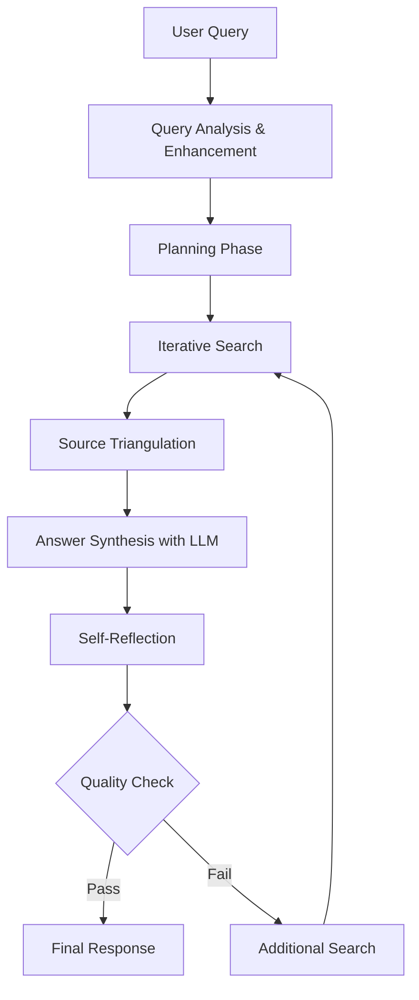

# PydanticAI Agentic RAG Agent Documentation

## Overview

The PydanticAI Agentic RAG Agent is an advanced retrieval-augmented generation system that goes beyond traditional RAG by incorporating intelligent reasoning, planning, and self-reflection capabilities. Built on PydanticAI, it provides sophisticated query understanding, iterative information gathering, source triangulation, and quality assessment for comprehensive knowledge-based question answering.

## 🎯 Goals

- **Intelligent Query Planning**: Decompose complex questions into strategic sub-queries
- **Iterative Retrieval**: Adaptive search with gap detection and coverage optimization
- **Self-Reflection**: Quality assessment and answer validation with confidence scoring
- **Source Triangulation**: Cross-reference multiple sources for accuracy verification
- **Explainable AI**: Transparent reasoning chains and decision processes
- **Hybrid Search Integration**: Seamless combination of vector and keyword search
- **LLM Integration**: Proper prompt engineering and answer synthesis

## 🏗️ Service Architecture

### Component Structure

```
📁 agentic_rag_agent/
├── 📄 main.py                          # FastAPI service entry point
├── 📄 config.py                        # Configuration management
├── 📄 agents/
│   ├── 📄 agentic_rag_service.py       # Main service orchestration
│   ├── 📄 planning_agent.py            # Query planning logic
│   ├── 📄 reflection_agent.py          # Self-assessment capabilities
│   └── 📄 search_agent.py              # Search coordination
├── 📄 models/
│   ├── 📄 request_models.py            # Input data models
│   ├── 📄 response_models.py           # Output data models
│   └── 📄 internal_models.py           # Internal processing models
├── 📄 tools/
│   ├── 📄 serach_tools.py              # Database search functions
│   ├── 📄 analysis_tools.py            # Content analysis utilities
│   └── 📄 triangulation_tools.py       # Source verification tools
├── 📄 services/
│   ├── 📄 database_manager.py          # Database operations
│   ├── 📄 embedding_service.py         # Embedding generation
│   ├── 📄 reranking_service.py         # Result reranking
│   └── 📄 llm_service.py               # LLM integration and prompts
├── 📄 utils/
│   ├── 📄 logger.py                    # Logging configuration
│   ├── 📄 metrics.py                   # Performance monitoring
│   └── 📄 validators.py                # Input validation
└── 📄 requirements.txt                 # Dependencies
```

### Agentic RAG Workflow



## 🧠 Core Agentic Features

### 1. Query Planning & Decomposition

**Intelligent Query Analysis:**
- Classifies queries by type (definitional, procedural, comparative, causal, analytical, etc.)
- Calculates complexity scores based on length, technical terms, and multi-part structure
- Breaks down complex questions into manageable sub-queries
- Determines optimal search strategies based on query type
- Predicts relevant source types and content domains

**Example Planning Process:**
```python
# Input: "Compare machine learning algorithms for NLP tasks"
query_plan = await planning_agent.create_query_plan(user_query)
# Output: QueryPlan with sub-queries, strategy, and reasoning
```

### 2. Iterative Information Gathering

**Adaptive Search Strategy:**
- Executes multiple search rounds with different parameters
- Identifies information gaps and coverage areas
- Adapts search terms based on intermediate findings
- Tracks unique sources and content diversity
- Adjusts similarity thresholds per iteration

**Search Evolution:**
```python
# Round 1: Broad search for "machine learning algorithms"
# Round 2: Focused search for "NLP performance metrics"  
# Round 3: Gap-filling search for "algorithm comparison studies"
```

### 3. Self-Reflection & Quality Assessment

**Multi-Dimensional Evaluation:**
- **Quality Score**: Content quality, source utilization, language clarity, structure
- **Completeness Score**: Question component coverage assessment
- **Accuracy Assessment**: Source reliability and factual consistency
- **Gap Detection**: Missing information identification

**Confidence Calculation:**
```python
quality_score = (relevance + source_utilization + language_quality + structure) / 4
confidence = quality_score * completeness_score * source_reliability
```

### 4. Source Triangulation

**Verification Process:**
- Extracts key concepts and factual claims from primary sources
- Searches for corroborating evidence using verification queries
- Seeks alternative perspectives and contradictory information
- Cross-references facts across multiple documents
- Assesses source credibility and authority

### 5. Hybrid Search with Reranking

**Multi-Stage Retrieval:**
1. **Vector Search**: Semantic similarity using OpenAI embeddings
2. **Keyword Search**: BM25 scoring for exact matches
3. **Hybrid Combination**: Weighted scoring (70% vector, 30% BM25 by default)
4. **Cross-Encoder Reranking**: Fine-grained relevance assessment using sentence-transformers

### 6. LLM Integration

**Prompt Engineering:**
- Specialized prompts for answer generation, query enhancement, and follow-up generation
- Context-aware prompt construction with source formatting
- Temperature and token management for consistent outputs
- Error handling and fallback responses

## 🚀 Getting Started

### Installation

```bash
# Clone the repository
git clone <repository-url>
cd agentic_rag_agent/

# Install dependencies
pip install -r requirements.txt
```

### Environment Configuration

Create a `.env` file:

```bash
# Required API Keys
OPENAI_API_KEY=your_openai_api_key
SUPABASE_URL=your_supabase_url
SUPABASE_SERVICE_KEY=your_supabase_service_key

# Database Configuration
TABLE_NAME=rag_documents

# Model Configuration
LLM_MODEL=gpt-4-turbo
EMBEDDING_MODEL=text-embedding-3-large
RERANK_MODEL=cross-encoder/ms-marco-MiniLM-L-6-v2

# Search Configuration
SIMILARITY_THRESHOLD=0.7
MAX_RESULTS=10
ENABLE_RERANKING=true
RERANK_TOP_K=20

# Hybrid Search Weights
VECTOR_WEIGHT=0.7
BM25_WEIGHT=0.3

# Agentic Features
MAX_ITERATIONS=3
MIN_SOURCES_PER_ITERATION=3
ENABLE_QUERY_PLANNING=true
ENABLE_SOURCE_TRIANGULATION=true
ENABLE_SELF_REFLECTION=true

# Performance Settings
MAX_CONCURRENT_SEARCHES=3
SEARCH_TIMEOUT_SECONDS=30
EMBEDDING_BATCH_SIZE=100

# Caching
ENABLE_QUERY_CACHE=true
CACHE_TTL_MINUTES=60
ENABLE_EMBEDDING_CACHE=true
EMBEDDING_CACHE_SIZE=10000

# Logging
LOG_LEVEL=INFO
DEBUG_MODE=false
```

### Running the Service

```bash
# Start the FastAPI server
python main.py

# Or with uvicorn directly
uvicorn main:app --host 0.0.0.0 --port 8001 --reload
```

### Basic Usage

#### Python Client

```python
import asyncio
import httpx

async def ask_question():
    async with httpx.AsyncClient() as client:
        response = await client.post(
            "http://localhost:8001/ask",
            json={
                "question": "What are the key differences between transformer and CNN architectures for computer vision tasks?",
                "enable_iteration": True,
                "enable_reflection": True,
                "enable_triangulation": True,
                "max_results": 10
            }
        )
        
        result = response.json()
        print(f"Answer: {result['answer']}")
        print(f"Confidence: {result['confidence']:.2f}")
        print(f"Sources: {len(result['sources'])}")
        print(f"Iterations: {result['iterations_completed']}")

asyncio.run(ask_question())
```

#### Direct Service Usage

```python
import asyncio
from agentic_rag_agent.config import get_config
from agentic_rag_agent.agents.agentic_rag_service import AgenticRAGService

async def main():
    # Configure the service
    config = get_config()
    
    # Initialize the agentic RAG service
    rag_service = AgenticRAGService(config)
    
    # Ask a complex question
    question = "What are the key differences between transformer and CNN architectures for computer vision tasks?"
    
    response = await rag_service.ask_with_planning(
        question=question,
        enable_iteration=True,
        enable_reflection=True,
        enable_triangulation=True
    )
    
    # Display results
    print(f"Answer: {response.answer}")
    print(f"Confidence: {response.confidence:.2f}")
    print(f"Sources: {len(response.sources)}")
    print(f"Search Iterations: {len(response.search_iterations)}")
    
    # Show reasoning process
    print("\nReasoning Chain:")
    for step in response.reasoning_chain:
        print(f"- {step}")
    
    # Display follow-up suggestions
    print("\nSuggested Follow-ups:")
    for suggestion in response.follow_up_suggestions:
        print(f"- {suggestion}")

if __name__ == "__main__":
    asyncio.run(main())
```

## ⚙️ Configuration Options

### RAGConfig Parameters

| Parameter | Type | Default | Description |
|-----------|------|---------|-------------|
| `supabase_url` | str | Required | Supabase project URL |
| `supabase_key` | str | Required | Supabase service key |
| `table_name` | str | "rag_documents" | Vector storage table name |
| `llm_model` | str | "gpt-4-turbo" | Language model for reasoning |
| `embedding_model` | str | "text-embedding-3-large" | Embedding model for vectors |
| `rerank_model` | str | "cross-encoder/ms-marco-MiniLM-L-6-v2" | Reranking model |
| `enable_reranking` | bool | True | Enable cross-encoder reranking |
| `vector_weight` | float | 0.7 | Weight for vector similarity in hybrid search |
| `bm25_weight` | float | 0.3 | Weight for BM25 score in hybrid search |
| `default_similarity_threshold` | float | 0.7 | Minimum similarity for retrieval |
| `default_max_results` | int | 10 | Maximum documents per search |
| `rerank_top_k` | int | 20 | Documents to consider for reranking |
| `max_context_length` | int | 8000 | Maximum context for answer generation |
| `min_confidence_threshold` | float | 0.3 | Minimum confidence for responses |
| `max_iterations` | int | 3 | Maximum search iterations |
| `min_sources_per_iteration` | int | 3 | Minimum sources required per iteration |

## 🔧 API Endpoints

### Core Endpoints

#### `/ask` - Full Agentic Processing
```http
POST /ask
Content-Type: application/json

{
  "question": "Your question here",
  "enable_iteration": true,
  "enable_reflection": true,
  "enable_triangulation": true,
  "search_method": "hybrid",
  "max_results": 10,
  "file_types": ["pdf", "md"],
  "similarity_threshold": 0.7
}
```

#### `/ask/simple` - Basic RAG
```http
POST /ask/simple
Content-Type: application/json

{
  "question": "Your question here",
  "search_method": "hybrid",
  "max_results": 5
}
```

#### `/ask/batch` - Batch Processing
```http
POST /ask/batch
Content-Type: application/json

{
  "questions": ["Question 1", "Question 2"],
  "enable_agentic": true,
  "max_concurrency": 3
}
```

### Utility Endpoints

#### `/analyze/query` - Query Analysis
```http
POST /analyze/query?question=Your question here
```

#### `/health` - Health Check
```http
GET /health
```

#### `/metrics` - Performance Metrics
```http
GET /metrics
```

#### `/cache/clear` - Clear Caches
```http
POST /cache/clear
```

### WebSocket Support

#### `/ws/ask` - Streaming Responses
```javascript
const ws = new WebSocket('ws://localhost:8001/ws/ask');

ws.onopen = function() {
    ws.send(JSON.stringify({
        question: "Your question here",
        enable_iteration: true
    }));
};

ws.onmessage = function(event) {
    const data = JSON.parse(event.data);
    if (data.type === 'reasoning') {
        console.log('Reasoning step:', data.step);
    } else if (data.type === 'response') {
        console.log('Final answer:', data.data.answer);
    }
};
```

## 📊 Response Models

### AgenticRAGResponse Structure

```python
class AgenticRAGResponse(BaseModel):
    answer: str                          # Generated answer
    confidence: float                    # Confidence score (0-1)
    sources: List[DocumentChunk]         # Retrieved source documents
    query_plan: QueryPlan               # Execution strategy
    reflection: ReflectionResult         # Quality assessment
    search_iterations: List[SearchResults]  # Search history
    reasoning_chain: List[str]           # Step-by-step reasoning
    follow_up_suggestions: List[str]     # Suggested next questions
    processing_time_ms: float            # Total processing time
    tokens_used: Optional[int]           # Tokens consumed by LLM
    iterations_completed: int            # Number of search iterations
    source_triangulation_performed: bool # Whether triangulation was used
    cross_validated_facts: List[str]     # Facts verified across sources
    potential_biases: List[str]          # Identified potential biases
```

### QueryPlan Details

```python
class QueryPlan(BaseModel):
    original_query: str                  # User's original question
    sub_queries: List[str]              # Generated sub-questions
    search_strategy: str                # "hybrid", "semantic", "keyword"
    reasoning: str                      # Planning rationale
    expected_sources: List[str]         # Predicted relevant file types
    complexity_score: float             # Query complexity (0-1)
    estimated_time: Optional[float]     # Estimated processing time
    recommended_iterations: Optional[int] # Recommended search iterations
```

### ReflectionResult Components

```python
class ReflectionResult(BaseModel):
    quality_score: float                # Overall quality (0-1)
    completeness_score: float          # Completeness assessment (0-1)
    accuracy_assessment: str           # "High", "Medium", "Low" confidence
    missing_information: List[str]     # Identified gaps
    suggested_follow_ups: List[str]    # Recommended next questions
    needs_more_search: bool           # Should continue searching
    reasoning_quality: Optional[float] # Quality of reasoning (0-1)
    source_diversity: Optional[float]  # Diversity of sources (0-1)
    factual_consistency: Optional[float] # Consistency score (0-1)
```

## 🎯 Use Cases and Examples

### 1. Research Analysis

```python
# Complex research question
question = """
Analyze the effectiveness of different renewable energy storage solutions 
for grid-scale applications, considering cost, efficiency, and scalability factors.
"""

response = await rag_service.ask_with_planning(question)

# Expected behavior:
# 1. Plans sub-queries for each storage type and evaluation criteria
# 2. Iteratively searches for technical specifications, cost data, case studies
# 3. Triangulates information across academic papers, industry reports
# 4. Reflects on completeness of cost/efficiency/scalability coverage
# 5. Provides comprehensive analysis with confidence assessment
```

### 2. Technical Comparison

```python
# Technical comparison query
question = "Compare the performance characteristics of Redis vs MongoDB for caching use cases"

response = await rag_service.ask_with_planning(
    question=question,
    enable_iteration=True,
    enable_triangulation=True
)

# Planning outcome:
# - Sub-queries: Redis performance, MongoDB caching, benchmark comparisons
# - Strategy: Hybrid search to find both technical docs and benchmark studies
# - Expected sources: Technical documentation, performance studies, blog posts
```

### 3. Domain-Specific Inquiry

```python
# Medical/legal domain query with high accuracy requirements
question = "What are the latest FDA guidelines for AI/ML in medical devices?"

response = await rag_service.ask_with_planning(
    question=question,
    enable_triangulation=True  # Extra verification for regulatory content
)

# Enhanced triangulation:
# - Seeks official FDA documents
# - Cross-references with industry compliance guides
# - Validates against recent regulatory updates
```

## 📈 Performance Optimization

### Caching Strategies

```python
# Enable query result caching
config.enable_query_cache = True
config.cache_ttl_minutes = 60

# Enable embedding caching
config.enable_embedding_cache = True
config.embedding_cache_size = 10000
```

### Batch Processing

```python
# Process multiple questions efficiently
questions = [
    "What is machine learning?",
    "How does deep learning work?", 
    "What are neural networks?"
]

# Via API
response = await client.post("/ask/batch", json={
    "questions": questions,
    "enable_agentic": True,
    "max_concurrency": 3
})
```

### Memory Management

```python
# Configure memory limits for large document sets
config.max_context_length = 4000      # Limit context size
config.max_concurrent_searches = 2    # Limit concurrent operations
config.embedding_batch_size = 50      # Smaller batches for memory
```

## 🔍 Monitoring and Debugging

### Performance Metrics

The service provides comprehensive metrics via the `/metrics` endpoint:

```json
{
  "total_queries": 150,
  "avg_query_time_ms": 2500,
  "successful_queries": 145,
  "failed_queries": 5,
  "avg_confidence_score": 0.82,
  "avg_iterations_per_query": 2.3,
  "llm_calls_total": 450,
  "cache_hit_rate": 0.65
}
```

### Health Monitoring

```python
# Check service health
health = await client.get("/health")
print(health.json())

# Output:
{
  "status": "healthy",
  "database_connected": true,
  "embedding_service": "healthy",
  "llm_service": "healthy",
  "success_rate": 96.67,
  "avg_response_time": 2.1
}
```

### Debug Mode

```python
# Enable detailed debugging
config.debug_mode = True
config.log_reasoning_steps = True
config.save_intermediate_results = True

# Debug output includes:
# - Detailed query planning decisions
# - Search iteration results
# - Reflection scoring breakdowns
# - LLM prompt and response logging
```

### Query Analysis

```python
# Analyze query processing without execution
analysis = await client.post("/analyze/query", params={"question": "Complex technical question"})

print(f"Query complexity: {analysis['complexity_score']}")
print(f"Predicted processing time: {analysis['estimated_processing_time']}s")
print(f"Recommended strategy: {analysis['recommended_strategy']}")
```

## 🚨 Error Handling and Resilience

### Graceful Degradation

The service implements multiple fallback strategies:

1. **LLM Service Failure**: Falls back to template-based responses
2. **Embedding Service Failure**: Uses keyword-only search
3. **Database Connectivity Issues**: Returns cached responses when available
4. **Search Timeout**: Returns partial results with appropriate confidence scores

### Retry Logic

```python
# Automatic retry with exponential backoff
config.max_retries = 3
config.retry_backoff_factor = 2.0
config.enable_graceful_degradation = True
```

## 🤝 Contributing

### Development Setup

```bash
# Clone and setup development environment
git clone <repository-url>
cd agentic_rag_agent/
python -m venv venv
source venv/bin/activate  # or `venv\Scripts\activate` on Windows
pip install -e ".[dev]"

# Run tests
pytest tests/

# Run linting
black agentic_rag_agent/
flake8 agentic_rag_agent/
mypy agentic_rag_agent/
```

### Testing Guidelines

```python
# Example test structure
import pytest
from agentic_rag_agent.agents.agentic_rag_service import AgenticRAGService

@pytest.mark.asyncio
async def test_query_planning():
    service = AgenticRAGService(test_config)
    
    # Test query planning
    plan = await service.planning_agent.create_query_plan(
        "Complex test question"
    )
    
    assert plan.complexity_score > 0
    assert len(plan.sub_queries) > 1
    assert plan.search_strategy in ["hybrid", "semantic", "keyword"]
```

## 📋 Dependencies

### Core Dependencies

- **pydantic-ai**: Core framework
- **supabase**: Vector database
- **openai**: LLM and embedding APIs
- **sentence-transformers**: Local embeddings and reranking
- **fastapi**: Web framework
- **psycopg2-binary**: PostgreSQL adapter

### Optional Dependencies

- **prometheus-client**: Metrics export
- **structlog**: Structured logging
- **rich**: Enhanced console output
- **nltk/spacy**: Advanced text processing

## 🔗 Architecture Decisions

### Why This Architecture?

1. **Modular Design**: Each component (planning, search, reflection) is independent and testable
2. **Async-First**: Built for high concurrency and non-blocking operations
3. **Configurable**: Extensive configuration options for different use cases
4. **Observable**: Comprehensive logging, metrics, and debugging capabilities
5. **Extensible**: Easy to add new search strategies, reflection criteria, or triangulation methods

### Design Patterns Used

- **Strategy Pattern**: For different search methods and reranking strategies
- **Observer Pattern**: For metrics collection and logging
- **Factory Pattern**: For creating internal models and components
- **Chain of Responsibility**: For processing workflow steps

## 📚 Additional Resources

- [Supabase Vector Documentation](https://supabase.com/docs/guides/ai)
- [OpenAI API Documentation](https://platform.openai.com/docs)
- [Sentence Transformers Documentation](https://www.sbert.net/)
- [FastAPI Documentation](https://fastapi.tiangolo.com/)

## 🆘 Troubleshooting

### Common Issues

1. **High Memory Usage**: Reduce `embedding_cache_size` and `max_context_length`
2. **Slow Responses**: Enable caching and reduce `max_iterations`
3. **Low Quality Answers**: Increase `similarity_threshold` and enable triangulation
4. **API Rate Limits**: Implement request throttling and caching
5. **Database Connection Issues**: Check Supabase credentials and network connectivity

### Performance Tuning

- **For Speed**: Disable triangulation, reduce iterations, increase similarity threshold
- **For Quality**: Enable all agentic features, allow more iterations, lower similarity threshold
- **For Scale**: Enable caching, use batch processing, implement connection pooling