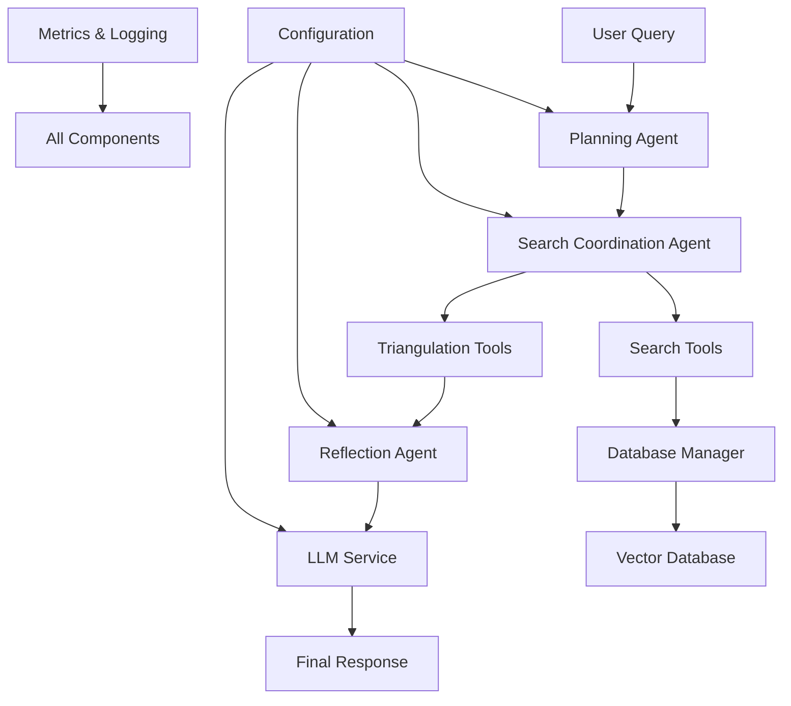
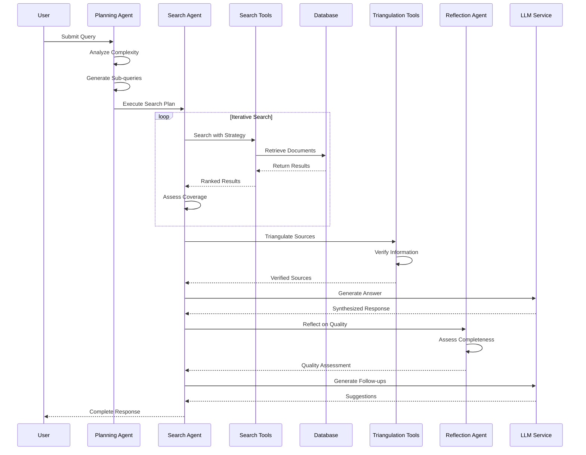
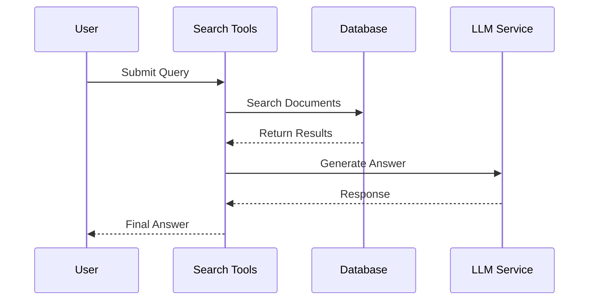

# PydanticAI Agentic RAG Agent - Complete System Documentation

## 📋 Table of Contents

1. [System Overview](#system-overview)
2. [Core Architecture](#core-architecture)
3. [Folder Structure Documentation](#folder-structure-documentation)
4. [Key Features](#key-features)
5. [Data Flow](#data-flow)
6. [Deployment Guide](#deployment-guide)
7. [Development Guide](#development-guide)

## System Overview

The PydanticAI Agentic RAG Agent is an advanced retrieval-augmented generation system that goes beyond traditional RAG by incorporating intelligent reasoning, planning, and self-reflection capabilities. Built with PydanticAI, it provides sophisticated query understanding, iterative information gathering, source triangulation, and quality assessment for comprehensive knowledge-based question answering.

### What Makes It "Agentic"

Unlike traditional RAG systems that follow a simple retrieve-generate pattern, this system:

- **Plans** complex queries by decomposing them into strategic sub-queries
- **Iterates** through multiple search rounds with adaptive parameters
- **Reflects** on answer quality and identifies information gaps
- **Triangulates** sources for accuracy verification and bias detection
- **Adapts** search strategies based on intermediate results

## Core Architecture



### Component Interactions

1. **Planning Agent** analyzes queries and creates execution strategies
2. **Search Coordination Agent** orchestrates iterative search processes
3. **Search Tools** provide multiple search strategies (hybrid, semantic, keyword)
4. **Database Manager** handles vector operations with Supabase
5. **Triangulation Tools** verify information across multiple sources
6. **Reflection Agent** assesses answer quality and completeness
7. **LLM Service** generates answers with proper prompt engineering

## Folder Structure Documentation

### 📁 `/agents/` - Intelligent Decision-Making Components

Contains the core agentic components that provide reasoning and decision-making capabilities:

- **`agentic_rag_service.py`** - Main orchestration service that coordinates all agents
- **`planning_agent.py`** - Query analysis and execution planning
- **`reflection_agent.py`** - Self-assessment and quality evaluation
- **`search_agent.py`** - Iterative search strategy coordination

**Key Responsibilities:**
- Query complexity analysis and decomposition
- Search strategy selection and adaptation
- Quality assessment and confidence scoring
- Multi-round search coordination

### 📁 `/models/` - Data Structure Definitions

Defines all data models used throughout the system using Pydantic:

- **`request_models.py`** - Input validation and request structures
- **`response_models.py`** - Output formats and API responses
- **`internal_models.py`** - Internal processing state management

**Key Features:**
- Type safety with Pydantic validation
- Comprehensive response metadata
- Internal state tracking for complex workflows
- Extensible model hierarchy

### 📁 `/services/` - Core Infrastructure Services

Provides fundamental services that power the system:

- **`database_manager.py`** - Vector database operations with Supabase
- **`embedding_service.py`** - Embedding generation with caching
- **`reranking_service.py`** - Result reranking with multiple strategies
- **`llm_service.py`** - Language model integration and prompt engineering

**Key Capabilities:**
- Hybrid search (vector + keyword)
- Embedding caching and batch processing
- Multiple reranking strategies
- Robust error handling and circuit breakers

### 📁 `/tools/` - Specialized Utility Functions

Contains specialized tools for specific tasks:

- **`search_tools.py`** - Advanced search implementations
- **`analysis_tools.py`** - Query and content analysis utilities
- **`triangulation_tools.py`** - Source verification and bias detection

**Key Functions:**
- Multi-strategy search execution
- Content pattern analysis
- Cross-reference verification
- Credibility assessment

### 📁 `/utils/` - Common Utilities

Shared utilities used across the system:

- **`logger.py`** - Structured logging with context
- **`metrics.py`** - Performance monitoring and Prometheus integration
- **`validators.py`** - Input validation and sanitization

**Key Features:**
- Comprehensive logging with correlation IDs
- Performance metrics collection
- Security-focused input validation
- Rate limiting and circuit breakers

### 📁 `/auth/` - Security and Authentication

Security components for production deployment:

- **`security.py`** - Authentication, rate limiting, and input sanitization

**Security Features:**
- JWT and API key authentication
- Rate limiting with configurable windows
- Input sanitization against injection attacks
- Security headers middleware

## Key Features

### 1. Intelligent Query Planning
- **Complexity Analysis**: Automatic assessment of query difficulty
- **Strategy Selection**: Optimal search method selection based on query type
- **Sub-query Generation**: Complex query decomposition
- **Resource Estimation**: Processing time and iteration prediction

### 2. Iterative Search with Adaptation
- **Multi-round Search**: Up to configurable iterations with different parameters
- **Gap Detection**: Identification of missing information
- **Strategy Adjustment**: Dynamic parameter tuning based on results
- **Source Diversification**: Ensuring variety in information sources

### 3. Source Triangulation
- **Cross-verification**: Fact checking across multiple sources
- **Bias Detection**: Identification of potential information biases
- **Credibility Assessment**: Source authority and reliability scoring
- **Alternative Perspectives**: Seeking diverse viewpoints on topics

### 4. Self-Reflection and Quality Assessment
- **Multi-dimensional Evaluation**: Quality, completeness, accuracy assessment
- **Confidence Scoring**: Automatic confidence level calculation
- **Improvement Suggestions**: Recommendations for better results
- **Follow-up Generation**: Intelligent next question suggestions

### 5. Hybrid Search Architecture
- **Vector Search**: Semantic similarity using OpenAI embeddings
- **Keyword Search**: BM25 scoring for exact matches
- **Combined Scoring**: Weighted hybrid approach
- **Reranking**: Cross-encoder fine-tuning for relevance

## Data Flow

### Agentic Processing Pipeline



### Simple RAG Flow



## Deployment Guide

### Prerequisites
- Python 3.11+
- Supabase account with vector database
- OpenAI API key
- Redis (optional, for caching)

### Quick Start

1. **Clone and Setup**
```bash
git clone <repository-url>
cd agentic_rag_agent/
python -m venv venv
source venv/bin/activate  # Windows: venv\Scripts\activate
pip install -r requirements.txt
```

2. **Environment Configuration**
```bash
cp .env.production .env
# Edit .env with your API keys and configuration
```

3. **Run the Service**
```bash
python main.py
# Or with Docker
docker-compose up
```

### Production Deployment

#### Docker Deployment
```bash
# Build and run with Docker Compose
docker-compose -f docker-compose.yml up -d

# With monitoring stack
docker-compose --profile monitoring up -d

# With production proxy
docker-compose --profile production up -d
```

#### Configuration Options

| Setting | Description | Default |
|---------|-------------|---------|
| `ENABLE_QUERY_PLANNING` | Enable intelligent query planning | `true` |
| `ENABLE_SOURCE_TRIANGULATION` | Enable source verification | `true` |
| `ENABLE_SELF_REFLECTION` | Enable quality assessment | `true` |
| `MAX_ITERATIONS` | Maximum search iterations | `3` |
| `SIMILARITY_THRESHOLD` | Vector similarity threshold | `0.7` |
| `VECTOR_WEIGHT` | Hybrid search vector weight | `0.7` |
| `BM25_WEIGHT` | Hybrid search keyword weight | `0.3` |

### Performance Tuning

#### For Speed (Low Latency)
```env
MAX_ITERATIONS=1
ENABLE_SOURCE_TRIANGULATION=false
ENABLE_RERANKING=false
SIMILARITY_THRESHOLD=0.8
```

#### For Quality (High Accuracy)
```env
MAX_ITERATIONS=3
ENABLE_SOURCE_TRIANGULATION=true
ENABLE_RERANKING=true
RERANK_TOP_K=20
SIMILARITY_THRESHOLD=0.6
```

#### For Scale (High Throughput)
```env
MAX_CONCURRENT_SEARCHES=5
ENABLE_QUERY_CACHE=true
EMBEDDING_BATCH_SIZE=200
ENABLE_EMBEDDING_CACHE=true
```

## Development Guide

### Adding New Features

#### 1. Adding a New Search Strategy
```python
# In tools/search_tools.py
async def custom_search(self, query: str, filters: SearchFilters) -> SearchResults:
    # Implement custom search logic
    pass

# Register in search_strategies dict
self.search_strategies['custom'] = self.custom_search
```

#### 2. Adding New Analysis Tools
```python
# In tools/analysis_tools.py
async def custom_analysis(self, content: str) -> Dict[str, Any]:
    # Implement analysis logic
    pass
```

#### 3. Extending Reflection Criteria
```python
# In agents/reflection_agent.py
def _assess_custom_quality(self, answer: str, sources: List[DocumentChunk]) -> float:
    # Implement custom quality assessment
    pass
```

### Testing

```bash
# Run tests
pytest tests/

# Run with coverage
pytest --cov=agentic_rag_agent tests/

# Run specific test category
pytest tests/test_agents.py -v
```

### Debugging

#### Enable Debug Mode
```env
DEBUG_MODE=true
LOG_LEVEL=DEBUG
LOG_REASONING_STEPS=true
SAVE_INTERMEDIATE_RESULTS=true
```

#### Use Debug Endpoint
```python
import httpx

response = httpx.post(
    "http://localhost:8001/debug",
    json={
        "question": "test question",
        "debug_level": "full",
        "include_intermediate_results": True,
        "include_timing": True
    }
)
```

### Monitoring

#### Metrics Endpoints
- `/metrics` - Performance metrics
- `/metrics/prometheus` - Prometheus format
- `/health` - Health check
- `/cache/stats` - Cache statistics

#### Log Analysis
```bash
# Filter logs by component
grep "planning_agent" logs/rag_agent.log

# Monitor real-time performance
tail -f logs/rag_agent.log | grep "processing_time"
```

### API Usage Examples

#### Full Agentic Processing
```python
response = await client.post("/ask", json={
    "question": "Compare machine learning frameworks for computer vision",
    "enable_iteration": True,
    "enable_reflection": True,
    "enable_triangulation": True,
    "max_results": 10
})
```

#### Simple RAG
```python
response = await client.post("/ask/simple", json={
    "question": "What is TensorFlow?",
    "search_method": "hybrid",
    "max_results": 5
})
```

#### Batch Processing
```python
response = await client.post("/ask/batch", json={
    "questions": ["Question 1", "Question 2", "Question 3"],
    "enable_agentic": True,
    "max_concurrency": 2
})
```