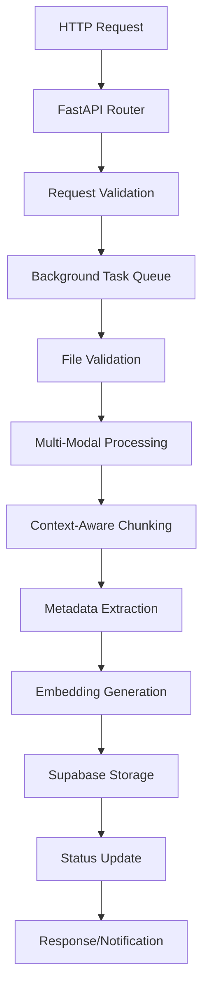

# LlamaIndex Ingestion Service Documentation

## Overview

The LlamaIndex Ingestion Service is a **standalone, production-ready** document processing pipeline designed to ingest, process, and prepare diverse file types for Retrieval-Augmented Generation (RAG) systems. It operates independently with its own FastAPI server, database connections, and processing capabilities.

## 🎯 Goals

- **Universal File Support**: Process 15+ file types including documents, spreadsheets, images, audio, code, and archives
- **Context-Aware Processing**: Intelligent chunking that preserves document structure and semantic meaning
- **Multi-Modal Intelligence**: Extract text from images (OCR), transcribe audio, and handle complex document formats
- **Scalable Architecture**: Concurrent processing with configurable batch sizes and resource limits
- **Production Ready**: Comprehensive error handling, logging, monitoring, and health checks
- **Independent Operation**: Complete standalone service that can be deployed and scaled independently

## 🏗️ Service Architecture

### Core Components

```
📁 ingestion_service/
├── 📄 main.py                          # FastAPI service entry point with lifespan management
├── 📄 config.py                        # Enhanced configuration with validation
├── 📄 processors/
│   ├── 📄 context_aware_chunker.py     # Intelligent chunking logic
│   ├── 📄 multimodal_processor.py      # File type processors
│   ├── 📄 metadata_extractor.py        # Metadata enhancement
│   └── 📄 ingestion_service.py         # Core service implementation
├── 📄 requirements.txt                 # Complete dependency list
├── 📄 Dockerfile                       # Container deployment
├── 📄 docker-compose.yml               # Standalone deployment
└── 📄 README.md                        # This documentation
```

### Enhanced Processing Pipeline



## 🚀 Independent Deployment

### Prerequisites

- Python 3.11+
- Supabase account with vector database (see [Vector Database Setup](#vector-database-setup))
- OpenAI API key
- Docker (optional, for containerized deployment)

### Quick Start (Standalone)

1. **Clone and Setup**
```bash
git clone <repository-url>
cd ingestion_service/

# Create virtual environment
python -m venv venv
source venv/bin/activate  # Windows: venv\Scripts\activate

# Install dependencies
pip install -r requirements.txt
```

2. **Environment Configuration**
```bash
# Copy example environment file
cp .env.example .env

# Edit .env with your configuration
nano .env
```

Required environment variables:
```bash
# Required
SUPABASE_URL=https://your-project.supabase.co
SUPABASE_SERVICE_KEY=your_service_key_here
OPENAI_API_KEY=your_openai_api_key_here

# Optional - Service Configuration
HOST=0.0.0.0
PORT=8000
LOG_LEVEL=INFO

# Optional - Processing Configuration
CHUNK_SIZE=1024
CHUNK_OVERLAP=200
MAX_FILE_SIZE_MB=100
BATCH_SIZE=100
MAX_CONCURRENT_FILES=5
```

3. **Vector Database Setup**

The ingestion service requires a properly configured vector database. If you haven't set it up yet:

```bash
# Navigate to vector database directory
cd ../vector_database/

# Set database environment variables
export SUPABASE_URL="your_supabase_url"
export SUPABASE_SERVICE_KEY="your_service_key"

# Run deployment script
chmod +x scripts/deploy.sh
./scripts/deploy.sh

# Return to ingestion service
cd ../ingestion_service/
```

4. **Run the Service**
```bash
# Development mode
python main.py

# Production mode
uvicorn main:app --host 0.0.0.0 --port 8000 --workers 4
```

5. **Verify Service**
```bash
# Check health
curl http://localhost:8000/health

# Check configuration
curl http://localhost:8000/config

# View API documentation
open http://localhost:8000/docs
```

### Docker Deployment (Recommended for Production)

1. **Using Docker Compose**
```bash
# Create docker-compose.yml
cat > docker-compose.yml << EOF
version: '3.8'

services:
  ingestion-service:
    build: .
    ports:
      - "8000:8000"
    environment:
      - SUPABASE_URL=\${SUPABASE_URL}
      - SUPABASE_SERVICE_KEY=\${SUPABASE_SERVICE_KEY}
      - OPENAI_API_KEY=\${OPENAI_API_KEY}
      - LOG_LEVEL=INFO
    volumes:
      - ./uploads:/app/uploads
      - ./logs:/app/logs
    restart: unless-stopped
    healthcheck:
      test: ["CMD", "curl", "-f", "http://localhost:8000/health"]
      interval: 30s
      timeout: 10s
      retries: 3
EOF

# Deploy
docker-compose up -d
```

2. **Using Docker directly**
```bash
# Build image
docker build -t ingestion-service .

# Run container
docker run -d \
  --name ingestion-service \
  -p 8000:8000 \
  -e SUPABASE_URL="your_supabase_url" \
  -e SUPABASE_SERVICE_KEY="your_service_key" \
  -e OPENAI_API_KEY="your_openai_key" \
  -v $(pwd)/uploads:/app/uploads \
  -v $(pwd)/logs:/app/logs \
  ingestion-service
```

## 📡 API Reference

### Core Endpoints

#### Health Check
```bash
GET /health
```
Returns service health status and database connectivity.

#### Ingest Files
```bash
POST /ingest/files
Content-Type: application/json

{
  "file_paths": ["/path/to/doc1.pdf", "/path/to/doc2.docx"],
  "batch_size": 50
}
```

#### Ingest Directory
```bash
POST /ingest/directory
Content-Type: application/json

{
  "directory_path": "/path/to/documents",
  "recursive": true,
  "file_extensions": ["pdf", "docx", "txt", "md"]
}
```

#### Upload and Ingest
```bash
POST /ingest/upload
Content-Type: multipart/form-data

# Upload files directly for processing
```

#### Task Status
```bash
GET /ingest/status/{task_id}
```
Check the status of a processing task.

#### Service Statistics
```bash
GET /stats
```
Get comprehensive service and database statistics.

### Response Format

All endpoints return structured JSON responses:

```json
{
  "task_id": "ingest_files_123",
  "status": "completed",
  "processed": ["/path/to/doc1.pdf"],
  "failed": [],
  "total_documents": 1,
  "total_chunks": 25,
  "processing_time": 12.5,
  "error": null
}
```

## 🔧 Configuration

### Complete Configuration Options

The service supports extensive configuration through environment variables:

#### Core Settings
- `SUPABASE_URL` - Supabase project URL (required)
- `SUPABASE_SERVICE_KEY` - Service key with database access (required)
- `OPENAI_API_KEY` - OpenAI API key for embeddings (required)
- `TABLE_NAME` - Database table name (default: "rag_documents")

#### Processing Settings
- `CHUNK_SIZE` - Maximum characters per chunk (default: 1024)
- `CHUNK_OVERLAP` - Overlap between chunks (default: 200)
- `MAX_FILE_SIZE_MB` - Maximum file size in MB (default: 100)
- `BATCH_SIZE` - Database insertion batch size (default: 100)
- `MAX_CONCURRENT_FILES` - Concurrent file processing limit (default: 5)

#### Feature Toggles
- `ENABLE_SEMANTIC_CHUNKING` - Enable semantic boundary detection (default: true)
- `ENABLE_HIERARCHICAL_CHUNKING` - Preserve document structure (default: true)
- `EXTRACT_METADATA` - Extract enhanced metadata (default: true)
- `ENABLE_OCR` - Process images with OCR (default: true)
- `ENABLE_SPEECH_TO_TEXT` - Transcribe audio files (default: true)

#### Model Configuration
- `EMBEDDING_MODEL` - OpenAI embedding model (default: "text-embedding-3-large")
- `LLM_MODEL` - LLM for metadata extraction (default: "gpt-4-turbo")

#### Service Configuration
- `HOST` - Service host (default: "0.0.0.0")
- `PORT` - Service port (default: 8000)
- `LOG_LEVEL` - Logging level (default: "INFO")
- `LOG_FILE` - Log file path (optional)

### Environment Validation

The service includes comprehensive environment validation:

```bash
# Validate current environment
python config.py

# Create example configuration
python -c "from config import create_example_env_file; create_example_env_file()"
```

## 🔍 Monitoring and Observability

### Built-in Monitoring

The service provides comprehensive monitoring capabilities:

#### Health Endpoints
- `/health` - Service and database health
- `/stats` - Processing statistics
- `/config` - Current configuration
- `/ingest/tasks` - Active task list

#### Metrics Tracked
- Files processed/failed counts
- Processing times and throughput
- Database connection status
- Memory and resource usage
- Error rates by type

#### Logging

Structured logging with multiple levels:
```python
# Configure logging level
export LOG_LEVEL=DEBUG  # DEBUG, INFO, WARNING, ERROR

# Configure log file
export LOG_FILE=./logs/ingestion.log
```

Log format includes:
- Timestamp and log level
- Component identification
- Request correlation IDs
- Processing metrics
- Error context and stack traces

### Production Monitoring

For production deployments, integrate with:

#### Application Monitoring
- **Prometheus**: Metrics exposition at `/metrics`
- **Grafana**: Dashboard for visualization
- **AlertManager**: Automated alerting

#### Log Aggregation
- **ELK Stack**: Elasticsearch, Logstash, Kibana
- **Splunk**: Enterprise log management
- **Cloud Logging**: AWS CloudWatch, Google Cloud Logging

#### Health Checks
```bash
# Docker health check
HEALTHCHECK --interval=30s --timeout=10s --retries=3 \
  CMD curl -f http://localhost:8000/health || exit 1

# Kubernetes liveness probe
livenessProbe:
  httpGet:
    path: /health
    port: 8000
  initialDelaySeconds: 30
  periodSeconds: 10
```

## 🧪 Testing

### Development Testing

```bash
# Install test dependencies
pip install pytest pytest-asyncio httpx

# Run tests
pytest tests/ -v

# Run with coverage
pytest tests/ --cov=. --cov-report=html
```

### Integration Testing

```bash
# Test with sample files
curl -X POST "http://localhost:8000/ingest/files" \
  -H "Content-Type: application/json" \
  -d '{"file_paths": ["./test_files/sample.pdf"]}'

# Check task status
curl "http://localhost:8000/ingest/status/ingest_files_0"

# Verify database storage
curl "http://localhost:8000/stats"
```

### Load Testing

```bash
# Install load testing tools
pip install locust

# Run load test
locust -f tests/load_test.py --host=http://localhost:8000
```

## 🚨 Troubleshooting

### Common Issues

#### 1. Service Won't Start
```bash
# Check configuration
python config.py

# Validate environment
python -c "from config import validate_environment; print(validate_environment())"

# Check dependencies
pip list | grep -E "(llama|supabase|openai)"
```

#### 2. Database Connection Issues
```bash
# Test Supabase connection
python -c "
from supabase import create_client
import os
client = create_client(os.getenv('SUPABASE_URL'), os.getenv('SUPABASE_SERVICE_KEY'))
print(client.table('rag_documents').select('count').execute())
"
```

#### 3. Processing Failures
```bash
# Check logs
tail -f logs/ingestion.log

# Verify file permissions
ls -la /path/to/files/

# Test with smaller files
echo "test content" > test.txt
curl -X POST "http://localhost:8000/ingest/files" \
  -H "Content-Type: application/json" \
  -d '{"file_paths": ["./test.txt"]}'
```

#### 4. Memory/Performance Issues
```bash
# Monitor resource usage
docker stats ingestion-service

# Adjust configuration
export MAX_CONCURRENT_FILES=2
export BATCH_SIZE=50
export MAX_FILE_SIZE_MB=50
```

### Error Recovery

The service includes automatic error recovery:
- **Circuit Breakers**: Prevent cascade failures
- **Retry Logic**: Exponential backoff for transient errors
- **Graceful Degradation**: Continue processing other files when one fails
- **Task Isolation**: Individual file failures don't affect batch processing

## 🔧 Advanced Configuration

### Performance Tuning

#### For High Throughput
```bash
# Increase concurrency
MAX_CONCURRENT_FILES=10
BATCH_SIZE=200

# Optimize chunking
CHUNK_SIZE=2048
ENABLE_SEMANTIC_CHUNKING=false
```

#### For Quality Focus
```bash
# Enable all features
ENABLE_SEMANTIC_CHUNKING=true
ENABLE_HIERARCHICAL_CHUNKING=true
EXTRACT_METADATA=true
ENABLE_OCR=true
ENABLE_SPEECH_TO_TEXT=true
```

#### For Resource Constraints
```bash
# Reduce resource usage
MAX_CONCURRENT_FILES=2
BATCH_SIZE=25
MAX_FILE_SIZE_MB=25
ENABLE_OCR=false
ENABLE_SPEECH_TO_TEXT=false
```

### Custom Processing

#### File Type Extensions
```bash
# Add custom file types
SUPPORTED_EXTENSIONS=pdf,docx,txt,md,custom_ext
```

#### Custom Processors
```python
# Extend multimodal_processor.py
class CustomProcessor(MultiModalFileProcessor):
    def _process_custom_format(self, file_path: str) -> List[Document]:
        # Custom processing logic
        pass
```

### Security Configuration

#### Production Security
```bash
# Disable debug features
DEBUG_MODE=false

# Restrict file types
SUPPORTED_EXTENSIONS=pdf,docx,txt,md

# Limit file sizes
MAX_FILE_SIZE_MB=50

# Enable audit logging
LOG_LEVEL=INFO
LOG_FILE=./logs/audit.log
```

## 📖 Development Guide

### Adding New Features

#### 1. New File Type Support
1. Add processor in `multimodal_processor.py`
2. Update `supported_extensions` in config
3. Add tests for new file type
4. Update documentation

#### 2. New Chunking Strategy
1. Extend `ContextAwareChunker`
2. Add configuration options
3. Test with various document types
4. Document strategy benefits

#### 3. New Metadata Extractors
1. Extend `MetadataExtractor`
2. Configure extraction parameters
3. Test extraction quality
4. Update response models

### Code Style and Standards

- **Type Hints**: Use comprehensive type annotations
- **Async/Await**: Proper async programming patterns
- **Error Handling**: Comprehensive exception handling
- **Logging**: Structured logging throughout
- **Testing**: Unit and integration test coverage
- **Documentation**: Inline docs and README updates

## 🤝 Contributing

1. Fork the repository
2. Create feature branch (`git checkout -b feature/amazing-feature`)
3. Follow code standards and add tests
4. Update documentation
5. Submit pull request

## 📄 License

This project is licensed under the MIT License - see the LICENSE file for details.

---

## 🆘 Support

For support and questions:

1. **Check Documentation**: Review this README and inline documentation
2. **Check Logs**: Enable DEBUG logging for detailed information
3. **Validate Environment**: Run configuration validation
4. **Test Components**: Use individual endpoint testing
5. **Community Support**: Submit issues with detailed reproduction steps

The LlamaIndex Ingestion Service is designed to be a robust, independent, and scalable solution for document processing in RAG systems. Its standalone architecture allows for flexible deployment while maintaining high performance and reliability.