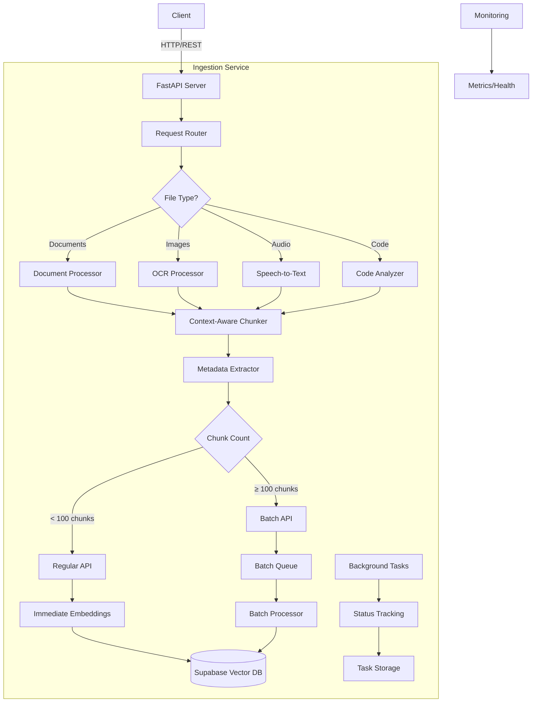
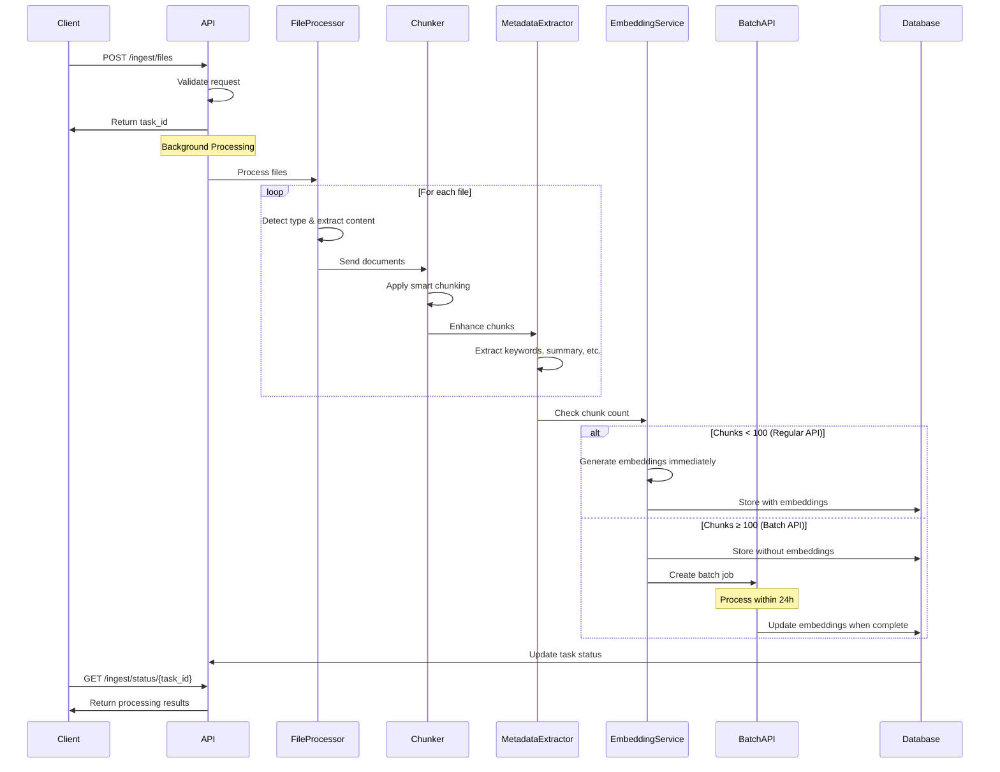

# LlamaIndex Ingestion Service Documentation

## Overview

The LlamaIndex Ingestion Service is a **standalone, production-ready** document processing pipeline designed to ingest, process, and prepare diverse file types for Retrieval-Augmented Generation (RAG) systems. It operates independently with its own FastAPI server, database connections, and processing capabilities.

## ✨ Key Features

- 🌐 Universal File Support: 15+ file types including PDFs, Office documents, images, audio, code, and archives
- 🧠 Intelligent Processing: Context-aware chunking with semantic boundaries and hierarchical document structure preservation
- 💰 Cost-Optimized Embeddings: Automatic routing between regular and Batch API based on volume (50% cost reduction for large batches)
- 🎯 Multi-Modal Intelligence: OCR for images, speech-to-text for audio, specialized parsers for code
- ⚡ Scalable Architecture: Concurrent processing, configurable batch sizes, and async operations
- 📊 Production Monitoring: Comprehensive metrics, health checks, and batch job tracking
- 🐳 Flexible Deployment: Docker, Docker Compose, or standalone Python

## 🏗️ Service Architecture

### Core Components

```
📁 ingestion_service/
├── 📄 main.py                          # FastAPI service entry point with lifespan management
├── 📄 config.py                        # Enhanced configuration with validation
├── 📄 processors/
│   ├── 📄 context_aware_chunker.py     # Intelligent chunking logic
│   ├── 📄 multimodal_processor.py      # File type processors
│   ├── 📄 metadata_extractor.py        # Metadata enhancement
│   └── 📄 ingestion_service.py         # Core service implementation
├── 📄 requirements.txt                 # Complete dependency list
├── 📄 Dockerfile                       # Container deployment
├── 📄 docker-compose.yml               # Standalone deployment
└── 📄 README.md                        # This documentation
```

### System Architecture



### Processing Pipeline


## 📡 API Reference

### Core Endpoints

#### 1. **Ingest Files**
```http
POST /ingest/files
Content-Type: application/json

{
  "file_paths": ["/path/to/doc1.pdf", "/path/to/doc2.docx"],
  "batch_size": 50  // Optional: Override default batch size
}

Response:
{
  "task_id": "ingest_files_123",
  "status": "started",
  "message": "Processing 2 files",
  "embedding_method": "batch"  // or "regular" based on estimated chunk count
}
```

#### 2. **Ingest Directory**
```http
POST /ingest/directory
Content-Type: application/json

{
  "directory_path": "/path/to/documents",
  "recursive": true,
  "file_extensions": ["pdf", "docx", "txt", "md"]
}
```

#### 3. **Upload and Ingest**
```http
POST /ingest/upload
Content-Type: multipart/form-data

Files: [file1.pdf, file2.docx, ...]
```

#### 4. **Check Task Status**
```http
GET /ingest/status/{task_id}

Response:
{
  "task_id": "ingest_files_123",
  "status": "completed",
  "processed": ["/path/to/doc1.pdf", "/path/to/doc2.docx"],
  "failed": [],
  "total_documents": 2,
  "total_chunks": 156,
  "processing_time": 23.5,
  "embedding_method": "batch",  // Method used for embeddings
  "error": null
}
```

### Batch API Endpoints

#### 5. **Process Pending Batches**
```http
POST /batch/process-pending

Response:
{
  "task_id": "batch_process_1234567890",
  "message": "Processing pending batches in background"
}
```

#### 6. **Batch Status**
```http
GET /batch/status

Response:
{
  "batch_jobs": {
    "pending": 3,
    "completed": 12,
    "failed": 1
  },
  "pending_embeddings": 450,
  "batch_api_enabled": true,
  "batch_threshold": 100,
  "estimated_savings_usd": 125.50
}
```

#### 7. **List Batch Jobs**
```http
GET /batch/jobs?status=pending&limit=10

Response:
{
  "total": 3,
  "jobs": [
    {
      "batch_id": "batch_abc123",
      "document_id": "doc_456",
      "status": "pending",
      "chunk_count": 234,
      "created_at": "2024-01-20T10:30:00Z"
    }
  ]
}
```

### Monitoring Endpoints

#### 8. **Health Check**
```http
GET /health

Response:
{
  "status": "healthy",
  "service": "ingestion",
  "database": "connected",
  "stats": {
    "total_documents": 15420,
    "total_chunks": 234561
  },
  "timestamp": "2024-01-20T10:30:00Z",
  "batch_api": {
    "enabled": true,
    "threshold": 100,
    "auto_processing": true
  }
}
```

#### 9. **Service Statistics**
```http
GET /stats

Response:
{
  "database_stats": {
    "total_documents": 15420,
    "total_chunks": 234561,
    "unique_files": 892
  },
  "task_stats": {
    "total_tasks": 156,
    "completed_tasks": 150,
    "failed_tasks": 3,
    "processing_tasks": 2,
    "pending_tasks": 1
  },
  "service_info": {
    "supported_file_types": ["pdf", "docx", "txt", ...],
    "processor_info": {...}
  },
  "batch_api_stats": {
    "batch_jobs": {"pending": 2, "completed": 45},
    "embeddings_via_regular_api": 5234,
    "embeddings_via_batch_api": 12456,
    "estimated_savings_usd": 125.50
  }
}
```

## 🚀 Deployment Methods

### Method 1: Docker Compose (Recommended)

#### Basic Deployment
```bash
# 1. Clone repository
git clone <repository-url>
cd ingestion_service/

# 2. Create .env file
cp .env.example .env
# Edit .env with your API keys

# 3. Deploy with Docker Compose
docker-compose up -d

# 4. Check health
curl http://localhost:8000/health
```

#### Production Deployment with Monitoring
```bash
# Deploy with Prometheus and Grafana
docker-compose --profile monitoring up -d

# Services will be available at:
# - Ingestion Service: http://localhost:8000
# - Prometheus: http://localhost:9090
# - Grafana: http://localhost:3000
```

#### Docker Compose Configuration
```yaml
version: '3.8'

services:
  ingestion-service:
    build: .
    ports:
      - "8000:8000"
    environment:
      - SUPABASE_URL=${SUPABASE_URL}
      - SUPABASE_SERVICE_KEY=${SUPABASE_SERVICE_KEY}
      - OPENAI_API_KEY=${OPENAI_API_KEY}
      - USE_BATCH_API=true
      - BATCH_API_THRESHOLD=100
      - AUTO_PROCESS_BATCHES=true
    volumes:
      - ingestion_uploads:/app/uploads
      - ingestion_logs:/app/logs
    healthcheck:
      test: ["CMD", "curl", "-f", "http://localhost:8000/health"]
      interval: 30s
    restart: unless-stopped
```

### Method 2: Standalone Python

#### Development Setup
```bash
# 1. Create virtual environment
python -m venv venv
source venv/bin/activate  # Windows: venv\Scripts\activate

# 2. Install dependencies
pip install -r requirements.txt

# 3. Configure environment
cp .env.example .env
# Edit .env with your configuration

# 4. Run service
python main.py
```

#### Production Setup with systemd (Linux)
```bash
# 1. Create service file
sudo nano /etc/systemd/system/ingestion-service.service

# 2. Add configuration:
[Unit]
Description=LlamaIndex Ingestion Service
After=network.target

[Service]
Type=simple
User=www-data
WorkingDirectory=/opt/ingestion_service
Environment="PATH=/opt/ingestion_service/venv/bin"
ExecStart=/opt/ingestion_service/venv/bin/python main.py
Restart=always

[Install]
WantedBy=multi-user.target

# 3. Enable and start
sudo systemctl enable ingestion-service
sudo systemctl start ingestion-service
```

### Method 3: Kubernetes Deployment

```yaml
apiVersion: apps/v1
kind: Deployment
metadata:
  name: ingestion-service
spec:
  replicas: 3
  selector:
    matchLabels:
      app: ingestion-service
  template:
    metadata:
      labels:
        app: ingestion-service
    spec:
      containers:
      - name: ingestion-service
        image: your-registry/ingestion-service:latest
        ports:
        - containerPort: 8000
        env:
        - name: SUPABASE_URL
          valueFrom:
            secretKeyRef:
              name: ingestion-secrets
              key: supabase-url
        - name: USE_BATCH_API
          value: "true"
        - name: AUTO_PROCESS_BATCHES
          value: "true"
        livenessProbe:
          httpGet:
            path: /health
            port: 8000
          initialDelaySeconds: 30
          periodSeconds: 10
```

## ⚙️ Configuration

### Environment Variables

```bash
# Required
SUPABASE_URL=https://your-project.supabase.co
SUPABASE_SERVICE_KEY=your_service_key_here
OPENAI_API_KEY=your_openai_api_key_here

# Batch API Configuration (New!)
USE_BATCH_API=true              # Enable batch API for cost savings
BATCH_API_THRESHOLD=100         # Use batch API when chunks >= 100
BATCH_API_WAIT_TIMEOUT=300      # Max seconds to wait for small batches
BATCH_CHECK_INTERVAL=300        # Check pending batches every 5 minutes
AUTO_PROCESS_BATCHES=true       # Automatically process batch jobs
PREFER_COST_SAVINGS=true        # Prefer batch API when possible
MAX_REGULAR_API_BATCH=20        # Max embeddings per regular API call

# Processing Configuration
CHUNK_SIZE=1024
CHUNK_OVERLAP=200
MAX_FILE_SIZE_MB=100
BATCH_SIZE=100
MAX_CONCURRENT_FILES=5

# Feature Toggles
ENABLE_SEMANTIC_CHUNKING=true
ENABLE_HIERARCHICAL_CHUNKING=true
EXTRACT_METADATA=true
ENABLE_OCR=true
ENABLE_SPEECH_TO_TEXT=true

# Model Configuration
EMBEDDING_MODEL=text-embedding-3-large
LLM_MODEL=gpt-4-turbo

# Service Configuration
HOST=0.0.0.0
PORT=8000
LOG_LEVEL=INFO
```

### Cost Optimization Settings

| Setting | Impact | Recommendation |
|---------|--------|----------------|
| `USE_BATCH_API=true` | 50% cost reduction on embeddings | Enable for production |
| `BATCH_API_THRESHOLD=100` | Minimum chunks for batch API | Lower for more savings |
| `AUTO_PROCESS_BATCHES=true` | Automatic batch processing | Enable for convenience |
| `MAX_REGULAR_API_BATCH=20` | Embeddings per API call | Increase for speed |

## 📊 Monitoring and Observability

### Built-in Monitoring

#### 1. **Metrics Dashboard**
Access real-time metrics at `/stats`:
- Processing statistics (files, chunks, time)
- Database statistics (documents, storage)
- Batch API usage and cost savings
- Task queue status

#### 2. **Health Monitoring**
```bash
# Simple health check
curl http://localhost:8000/health

# Detailed statistics
curl http://localhost:8000/stats | jq
```

#### 3. **Batch Job Monitoring**
```bash
# Check batch status
curl http://localhost:8000/batch/status

# List pending jobs
curl "http://localhost:8000/batch/jobs?status=pending"
```

### Prometheus Integration

```yaml
# prometheus.yml
scrape_configs:
  - job_name: 'ingestion-service'
    static_configs:
      - targets: ['ingestion-service:8000']
    metrics_path: '/metrics'
    scrape_interval: 5s
```

### Logging

#### Structured Logs
```json
{
  "timestamp": "2024-01-20T10:30:45.123Z",
  "level": "INFO",
  "service": "ingestion",
  "task_id": "ingest_files_123",
  "event": "file_processed",
  "file": "/path/to/document.pdf",
  "chunks": 45,
  "embedding_method": "batch",
  "processing_time": 2.34
}
```

#### Log Aggregation
- **ELK Stack**: Ship logs to Elasticsearch
- **CloudWatch**: AWS native logging
- **Datadog**: APM and log correlation

### Alerting

```yaml
# Example Prometheus alerts
groups:
- name: ingestion_alerts
  rules:
  - alert: HighFailureRate
    expr: rate(ingestion_failures_total[5m]) > 0.1
    for: 5m
    annotations:
      summary: "High ingestion failure rate"
      
  - alert: BatchJobBacklog
    expr: ingestion_batch_jobs_pending > 100
    for: 30m
    annotations:
      summary: "Large batch job backlog"
```

## 🔧 Extension and Customization

### Adding New File Types

#### 1. Create Custom Processor
```python
# processors/custom_processor.py
async def _process_custom_format(self, file_path: str) -> List[Document]:
    """Process custom file format"""
    # Your processing logic
    content = extract_content_from_custom_format(file_path)
    return [Document(text=content, metadata={...})]

# Register in multimodal_processor.py
self.processors['custom'] = self._process_custom_format
```

#### 2. Update Configuration
```python
# config.py
supported_extensions = [..., 'custom']
```

### Custom Chunking Strategies

```python
# processors/custom_chunker.py
class DomainSpecificChunker(ContextAwareChunker):
    def _chunk_domain_content(self, document: Document) -> List[BaseNode]:
        """Custom chunking for domain-specific content"""
        # Implement domain logic
        pass
```

### Metadata Enhancement

```python
# Add custom metadata extractors
class CustomMetadataExtractor(MetadataExtractor):
    async def extract_domain_metadata(self, chunk: Document) -> Dict:
        """Extract domain-specific metadata"""
        return {
            'custom_field': analyze_content(chunk.text),
            'domain_score': calculate_relevance(chunk.text)
        }
```

### Webhook Integration

```python
# Add webhook notifications
@app.post("/ingest/files")
async def ingest_with_webhook(request: IngestRequest):
    result = await ingest_files(request.file_paths)
    
    # Notify webhook
    if request.webhook_url:
        await notify_webhook(request.webhook_url, result)
    
    return result
```

### Custom Storage Backends

```python
# Implement alternative storage
class S3StorageBackend:
    async def store_chunk(self, chunk_data: Dict):
        """Store in S3 instead of Supabase"""
        # Implementation
        pass
```

## 🎯 Best Practices

### Performance Optimization

1. **Batch Processing**
   - Use larger batch sizes for better throughput
   - Enable batch API for documents with many chunks
   - Process similar file types together

2. **Resource Management**
   - Set appropriate concurrency limits
   - Monitor memory usage for large files
   - Use streaming for very large documents

3. **Cost Optimization**
   - Enable batch API for all production workloads
   - Process files during off-peak hours
   - Monitor embedding costs in dashboard

### Production Checklist

- [ ] Configure all required environment variables
- [ ] Set up database with proper indexes
- [ ] Enable batch API for cost savings
- [ ] Configure monitoring and alerting
- [ ] Set up log aggregation
- [ ] Implement backup strategy
- [ ] Test error recovery mechanisms
- [ ] Document custom configurations

## 📝 Troubleshooting

### Common Issues

| Issue | Solution |
|-------|----------|
| Batch jobs not processing | Check `AUTO_PROCESS_BATCHES=true` and run `/batch/process-pending` |
| High memory usage | Reduce `MAX_CONCURRENT_FILES` and chunk sizes |
| Slow processing | Enable batch API, increase concurrency |
| Failed embeddings | Check OpenAI API limits and quotas |

### Debug Mode

```bash
# Enable debug logging
LOG_LEVEL=DEBUG python main.py

# Check specific task
curl http://localhost:8000/ingest/status/task_123
```
